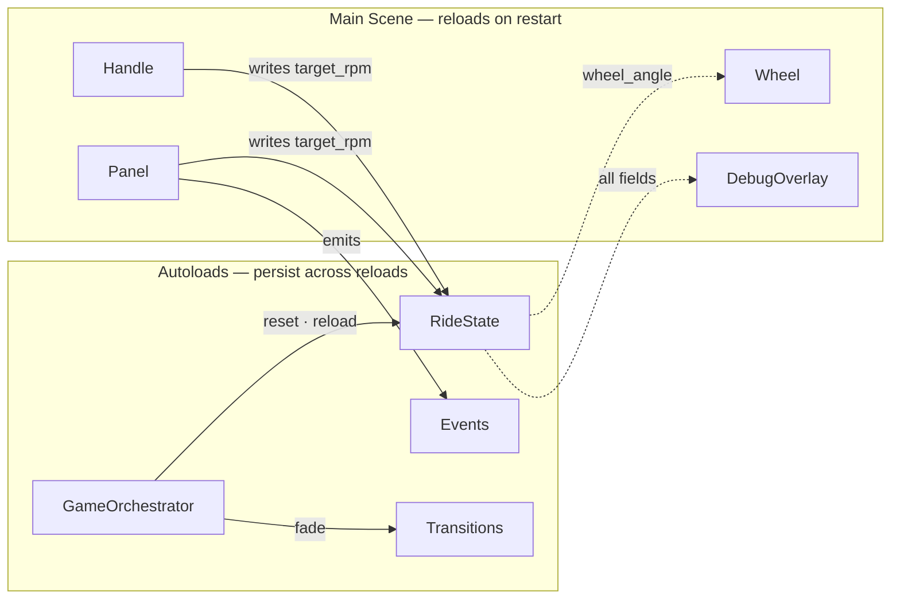
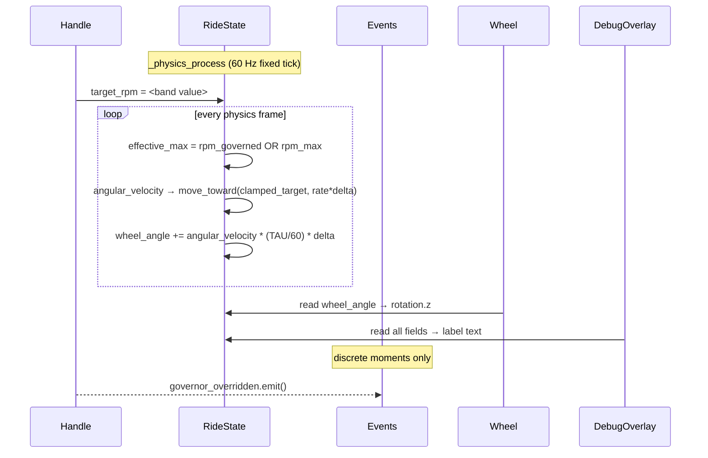

# MVP Architecture Overview

**Scope: Step 0 MVP — spin only.** This documents the architecture as it stands today: a player-controlled wheel that spins with inertia, a governed RPM ceiling, and a debug readout. No riders, no heat, no structural integrity, no economy, no fail states. Those systems will extend `RideState` and emit through `Events` when they arrive — the architecture is designed to absorb them without restructuring.

Two diagrams: **ownership** (what exists and who owns it) and **data flow** (what reads and writes what, and when). Read ownership first.

---

## 1. Ownership



| Node | Role |
|---|---|
| `GameOrchestrator` | Phase FSM, restart lifecycle |
| `RideState` | Authoritative sim data, physics tick |
| `Events` | Signal bus — discrete core moments only |
| `Transitions` | Fade curtain, owned CanvasLayer |
| `Wheel` | Pure view — reads `wheel_angle`, writes nothing |
| `Handle` | Player input — writes `target_rpm` |
| `Panel` | Control coordinator — maps inputs to `RideState` and `Events` |
| `DebugOverlay` | Dev readout — reads all fields, writes nothing |

**Rules that flow from this diagram:**
- Autoloads survive scene reloads. Scene nodes do not. Run state belongs in `RideState`, never on a scene node.
- Arrows into `RideState` are writes. Arrows out are reads. `RideState` never holds a reference to any scene node.
- `Events` has no arrows — it is only a signal bus. Anything can emit or connect; nothing owns it.
- `Panel` is a scene node, not an autoload. It has presence, input, and visuals. It reloads cleanly with Main.

---

## 2. Data Flow



**Rules that flow from this diagram:**
- `Handle` writes `target_rpm` from `_process` (every render frame). `RideState` consumes it on the next physics tick. The inertia model (`move_toward`) means the write is a *request*, not an instant change.
- `Wheel` and `DebugOverlay` are **pure readers** — they call nothing, emit nothing, change nothing. Any future visual system (gauge, gondola swing, smoke) follows the same pattern.
- `Events` carries only discrete moments — things that *happened*, not things that *are*. Continuous values (rpm, angle) are always polled directly from `RideState`, never signalled every tick.

---

## 3. Wiring Wheel to a new Node3D

When a wheel model arrives, attach `Wheel.gd` to its root `Node3D`. The script is three lines:

```gdscript
extends Node3D

func _process(_delta: float) -> void:
    rotation.z = RideState.wheel_angle
```

`rotation.z` assumes the wheel's axle is the Z axis. If pcpuppet's model has the axle on a different axis, change `rotation.z` to match — the value and the logic stay identical.

`wheel_angle` accumulates freely in radians from session start. Godot normalises the visual rotation automatically. Two useful derived values for future systems:

| Expression | Meaning |
|---|---|
| `RideState.wheel_angle / TAU` | Total rotations completed |
| `fmod(RideState.wheel_angle, TAU)` | Current position within one rotation (0 → ~6.28) |

---

## 4. Adding a new visual system

Every future cosmetic (gauge needle, gondola swing, motion blur, audio pitch) follows the same three-step pattern:

1. **Create a Node or scene** — presence, visuals, no sim logic.
2. **Read from `RideState` in `_process`** — poll the field you need each render frame.
3. **Connect to `Events` for discrete reactions** — if you need to respond to a moment (fling, overheat), connect to the relevant signal. Never emit from a visual system.

Nothing else is needed. No registration, no notification to `RideState`, no new autoloads.
